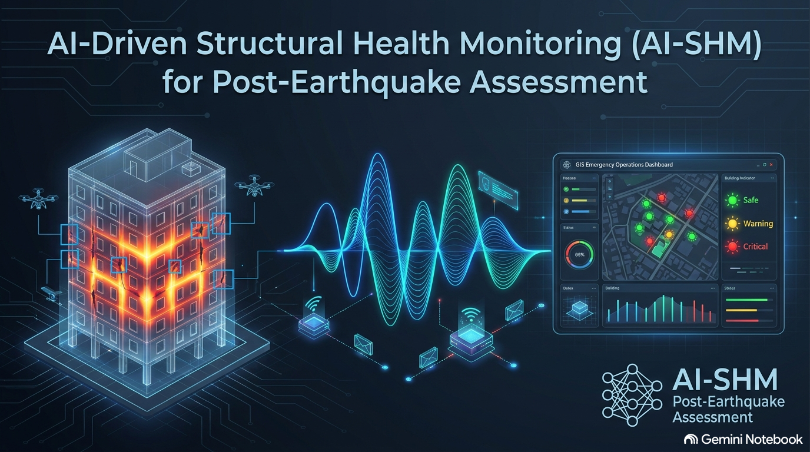

# AI-Driven Structural Health Monitoring for Post-Earthquake Damage Assessment and Prediction
### *A Multimodal, Physics-Informed Cross-Regional Framework*

[](https://opensource.org/licenses/MIT)
[](https://www.python.org/downloads/)
[](https://pytorch.org/)
[](https://www.raspberrypi.com/products/rp2040/)
[](#citation)

---

## 📌 Executive Summary

This repository contains the official implementation of the paper:
**"AI-Driven Structural Health Monitoring for Post-Earthquake Damage Assessment and Prediction: A Multimodal, Physics-Informed Cross-Regional Framework"**.

The framework bridges high-resolution UAV computer vision embeddings with IoT triaxial accelerometer time-series to assess both surface structural damage pathologies and internal stiffness loss. Constrained by MDOF equations of motion and geotechnical physical boundaries ($V_{s1} = 215 \text{ m/s}$), the system streams real-time, compressed 2-byte MQTT safety tags directly to municipal Emergency Operation Center (EOC) GIS dashboards.

---

## 🚀 Key Features

- **Multimodal Synergy:** Fuses UAV visual embeddings (YOLOv11 & STCHMDA-CVT) with triaxial vibration signatures (1D-CNN–BiLSTM + ESD).
- **Physics-Informed Meta-Learning:** Integrates LightGBM meta-classifier constrained by MDOF equations of motion and geotechnical stability limits.
- **Ultra-Low Latency Edge ML:** Microcontroller C++ execution on RP2040 nodes with $<525 \text{ ms}$ latency and 1.4 KB SRAM footprint.
- **Cross-Regional Generalization:** Domain Adversarial Neural Networks (DANN) validated across 11 global seismic benchmarks (Türkiye, Nepal, Taiwan, Italy DaDO, Mexico, Korea, PEER/CESMD).
- **Emergency Operations Center (EOC) GIS Integration:** Automated ATC-20/EMS-98 safety tagging (Green/Yellow/Red) over LoRaWAN/NB-IoT.

---

## 📁 Repository Structure

```text
├── data/
│   ├── raw/                 # Dataset pointers (11 global seismic events)
│   ├── processed/           # Processed CWT spectrograms and vibration features
│   └── synthetic/           # CutMix/MixUp/GAN augmented vision datasets
├── models/
│   ├── vision/              # YOLOv11 & STCHMDA-CVT model definitions
│   ├── vibration/           # 1D-CNN-BiLSTM & ESD feature extractors
│   ├── pinn/                # Physics-informed MDOF loss & LightGBM meta-learner
│   └── dann/                # Domain Adversarial Neural Network (GRL layer)
├── edge_rp2040/
│   ├── src/                 # Quantized C++ inference engine for RP2040
│   ├── CMakeLists.txt       # Pico SDK build configuration
│   └── weights/             # int8 quantized model weights
├── eoc_gis/
│   ├── server.py            # Real-time MQTT subscriber & GIS dashboard
│   └── static/              # Interactive Leaflet/GIS web interface
├── docs/                    # Architecture diagrams & figures
├── requirements.txt         # Python dependencies
├── train.py                 # Full pipeline training script
└── README.md                # Project documentation
```

---

## 🛠️ Installation & Setup

### Prerequisites
- Python 3.10+
- PyTorch 2.1+ with CUDA 12.0
- Raspberry Pi Pico SDK (for compiling Edge C++ firmware)

```bash
# Clone the repository
git clone https://github.com/mohammadshariatmadari/AI-SHM-PostEarthquake.git
cd AI-SHM-PostEarthquake

# Create a virtual environment
python -m venv venv
source venv/bin/activate  # On Windows: venv\Scriptsctivate

# Install dependencies
pip install -r requirements.txt
```

---

## 🚦 Quick Start

### 1. Training Vision & Vibration Pipelines
```bash
# Train YOLOv11 + STCHMDA-CVT vision model
python train.py --modality vision --backbone yolov11 --epochs 100

# Train 1D-CNN-BiLSTM vibration model
python train.py --modality vibration --batch_size 64 --lr 0.001
```

### 2. Physics-Informed Meta-Learning & DANN Training
```bash
# Train PINN meta-classifier with MDOF physical loss constraint
python train.py --modality pinn_meta --alpha_pinn 0.15

# Execute Domain Adaptation (DANN) across target earthquake domain
python train.py --modality dann --target_domain italy_dado
```

### 3. Edge Microcontroller Build (RP2040)
```bash
cd edge_rp2040
mkdir build && cd build
cmake ..
make -j4
# Flash build/rp2040_shm_edge.uf2 to Raspberry Pi Pico / RP2040
```

### 4. Launch EOC GIS Real-Time Server
```bash
python eoc_gis/server.py --broker_ip 127.0.0.1 --port 1883
```

---

## 📊 Performance Summary

| Benchmark Dataset | Vision F1-Score | Vibration Acc (%) | PINN Combined Acc (%) | Latency (RP2040) |
| :--- | :---: | :---: | :---: | :---: |
| **Türkiye 2023** | 99.27% | 88.40% | 94.80% | 521 ms |
| **Italy DaDO** | 98.15% | 87.90% | 93.65% | 518 ms |
| **Taiwan 2024** | 98.90% | 89.10% | 95.10% | 524 ms |
| **Nepal 2015** | 97.80% | 86.50% | 92.40% | 512 ms |

---

## 📄 Citation

If you find this code or research useful in your work, please cite our paper:

```bibtex
@article{ai_shm_post_earthquake_2026,
  title={AI-Driven Structural Health Monitoring for Post-Earthquake Damage Assessment and Prediction: A Multimodal, Physics-Informed Cross-Regional Framework},
  author={Mohammad Shariatmadari, et al.},
  journal={Journal of Building Engineering / Automation in Construction},
  year={2026},
  volume={--},
  pages={--},
  publisher={Elsevier / IEEE}
}
```

---

## 📜 License & Contact

Distributed under the **MIT License**. See `LICENSE` for details.

- **Author:** Mohammad Shariatmadari
- **Email:** your.email@university.edu
- **Project Link:** [https://github.com/mohammadshariatmadari/AI-SHM-PostEarthquake](https://github.com/mohammadshariatmadari/AI-SHM-PostEarthquake)
